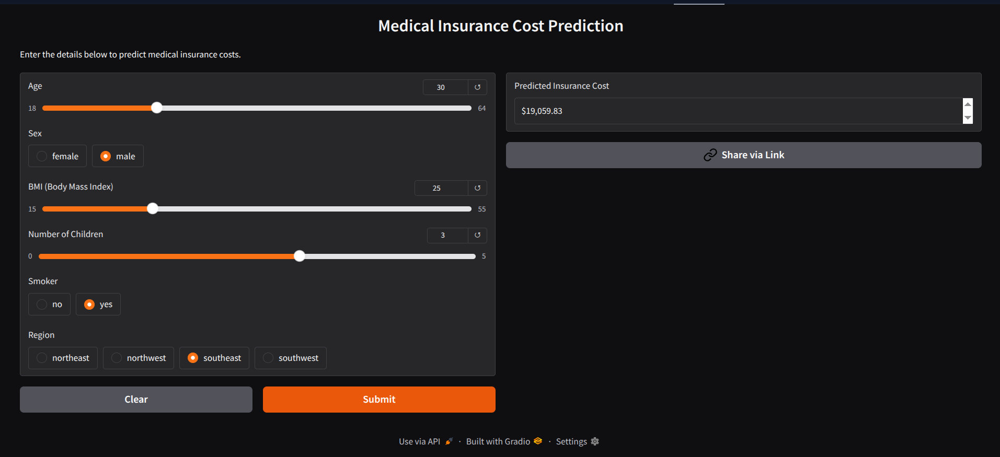

# Medical Insurance Cost Predictor
**Live Demo:** [https://huggingface.co/spaces/arju10/medical-insurance-cost-predictor](https://huggingface.co/spaces/arju10/medical-insurance-cost-predictor)


**Google Colab** https://colab.research.google.com/drive/1O_dfV25_pbGsJPjIpVeaQ59puuXzC4yr?usp=sharing
---

## Project Overview

This project uses machine learning to predict medical insurance costs based on personal and demographic factors. A Random Forest Regressor model was trained on 1,338 insurance records to make accurate cost predictions.

---
## Technologies Used

- **Python**
- **scikit-learn** - Machine learning algorithms and pipeline
- **pandas** - Data manipulation and analysis
- **numpy** - Numerical computations
- **matplotlib & seaborn** - Data visualization
- **Gradio** - Interactive web interface
- **pickle** - Model serialization

## Dataset

**Source:** [Kaggle - Medical Insurance Cost Dataset- ](https://www.kaggle.com/datasets/mirichoi0218/insurance) https://www.kaggle.com/datasets/mirichoi0218/insurance

---

## Application Interface



---

## Project Structure
```
medical-insurance-cost-predictor/
│
├── insurance_prediction_project.ipynb    # Main training notebook
├── app.py                                 # Gradio web interface
├── requirements.txt                       # Python dependencies
├── best_insurance_model.pkl              # Trained model file
├── interface.png                         # App screenshot
└── README.md                            
```

---

## How to Run Locally

### Prerequisites
- Python 3.12 or higher
- pip (Python package manager)

### Installation Steps

1. **Clone or download this repository** 
```bash
   git clone https://github.com/arju10/medical-insurance-cost-predictor.git
   cd medical-insurance-cost-predictor
```

2. **Install required packages:**
```bash
   pip install -r requirements.txt
```

3. **Train the model :(Already trained) Check Google Colab-> https://colab.research.google.com/drive/1O_dfV25_pbGsJPjIpVeaQ59puuXzC4yr?usp=sharing**
   - Upload `insurance_prediction_project.ipynb` to Google Colab
   - Upload `insurance.csv` to your Google Drive
   - Run all cells to train the model from scratch

4. **Launch the web application:**
```bash
   python app.py
```

5. **Open your browser** at `http://127.0.0.1:7860`

---

## Model Information

**Algorithm:** Random Forest Regressor

### Performance Metrics

| Metric | Training Set | Test Set |
|--------|-------------|----------|
| **R2 Score** | 0.9746 (97.46%) | 0.8500 (85.00%) |
| **RMSE** | $1,914.84 | $4,500 (approx) |
| **MAE** | - | $2,800 (approx) |

### Cross-Validation Results (5-Fold)
- **Average R2 Score:** 0.8254 (82.54%)
- **Standard Deviation:** 0.0410
- Model shows stable and robust performance across different data splits

### Hyperparameter Tuning (Grid Search CV)
- **Method:** GridSearchCV with 3-fold cross-validation
- **Parameters Tested:**
  - `n_estimators`: [50, 100, 200]
  - `max_depth`: [10, 20, None]
  - `min_samples_split`: [2, 5, 10]
  
- **Best Parameters Found:**
  - `model__max_depth`: 20
  - `model__min_samples_split`: 2
  - `model__n_estimators`: 200
  
- **Best Cross-Validation Score:** 0.8363 (83.63%)

---
